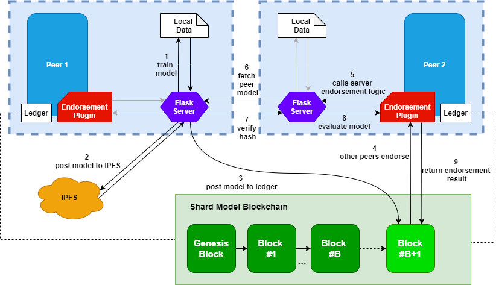

# ScaleSFL: Scalable blockchain-based Sharding solution for Federated Learning

This project implements ScaleSFL (Scalable blockchain-based Sharding solution for Federated Learning). This approach extends previous approaches such as [Committee Consensus](https://arxiv.org/pdf/2004.00773.pdf), by providing a sharding mechanism, where model updates are verified independently within each shard, and further aggregated to produce a global model.



This implemention uses [Hyperledger Fabric](https://www.hyperledger.org/use/fabric) as the blockchain platform, using Fabric channels as independent "shards". Federated Learning is implemented using the [Flower](https://flower.dev/) framework. This allows for further scalability, and capacity of the network. We test our approach using [Hyperledger Caliper](https://www.hyperledger.org/use/caliper), a benchmarking tool.

## Getting Started

### Prerequisites

Make sure you have the proper Hyperledger Fabric [prerequisites](https://hyperledger-fabric.readthedocs.io/en/release-2.2/prereqs.html)

To get the binaries required to run the project, you can run the command

```sh
curl -fsSL https://raw.githubusercontent.com/hyperledger/fabric/master/scripts/bootstrap.sh | bash -s
```

Next check the commands available by running

```sh
cd test-network
./network.sh -h
```

### Running the network

This project relies on several independent componenets. The first step is to bring up the test network in order to use the Fabric blockchain. This is based on the test-network provided by [fabric-samples](https://github.com/hyperledger/fabric-samples), modified to handle many peers & organizations. Each peer will join a different channel (shard) by default.

#### Create Peer Image

We'll first need to create a fabric peer image with our endorsement plugin built in. Instructions to so can be found in the [plugins](plugins/README.md) folder.

#### Launch Peer Workers

The endorsement plugin relies on the peers for this network, we must launch the peer workers prior to launching the fabric network. We can run locally by using the manager script in `example-participant/fl-service`. You can find instructions in [example-participant](example-participant/README.md), please follow these and run the manager script, e.g.

```sh
python manager.py -p 8 -s 8 --num-threads=1
```

#### Launch Fabric network

Now we can bring up the network by running

```sh
./startFabric.sh
```

We can verify each of the peers have joined the correct channel by viewing the channels

Set the correct binaries path, and config directory

```sh
export PATH=$(realpath ${PWD}/../bin):$PATH
export FABRIC_CFG_PATH=$(realpath ${PWD}/../config/)

. scripts/envVar.sh
setGlobals 1
```

We can check which channels a peer is in using

```sh
peer channel list
```

#### Shutdown the network

Finally we can bring the network down using

```sh
./network.sh down
```

### Testing

We perform workload tests using [Hyperledger Caliper](https://www.hyperledger.org/use/caliper). Instructions to run this on the existing network can be found in [caliper-tests](caliper-tests/README.md).

The analysis for these tests can be found in the [notebooks](example-participant/fl-service/notebooks/caliper-analysis.ipynb).

The main findings from these results show this solution scales with the number of shards


